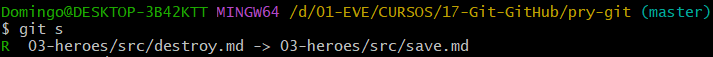
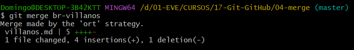
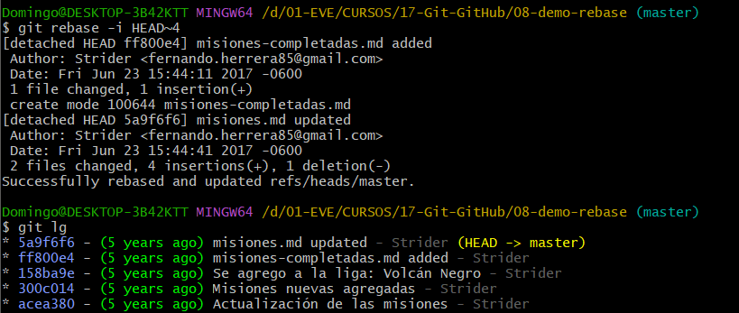
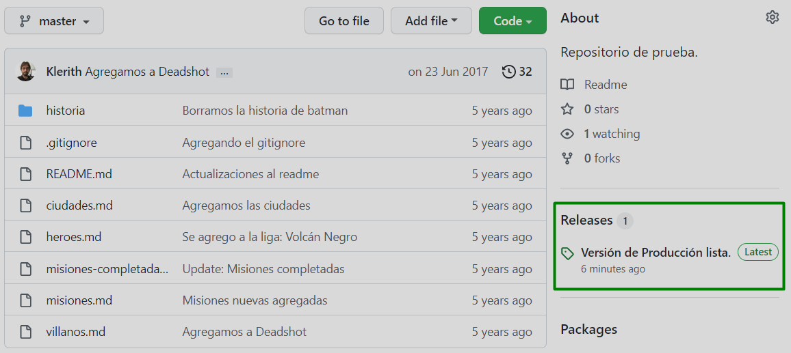
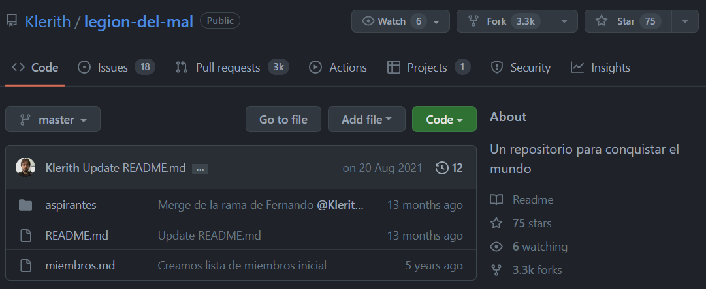
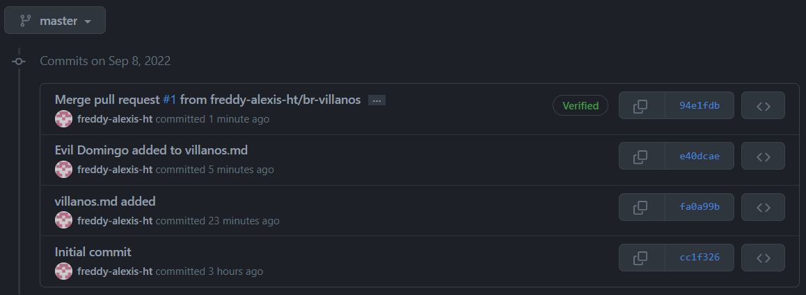

## 1. PROJECT CONFIGURATION AND BASIC COMMANDS

For this course it's necessary to have git version 2.10+

---

### 1.1 Local-repo and Remote-repo

- Remote-repo creation, name: Git-GitHub
  - Add a README file
  - Licence: GNU GLP v3
- In the file 'pry-git' open GitBash:
  - `git init` .. Local-repo creation.
  - `git remote add origin https://github.com/freddy-alexis-ht/JavaFX.git` .. Repos linking
  - `git pull origin master` .. Branches sync.

It's possible that on execution of `git init` a message is shown recommending us to change the default branch from 'master' to 'main'.

So, previous of 'git init', we can configure it with:  
`git config --global init.defaultBranch <name>`

If the branch is already created, the name can be changed with:  
`git branch -m <name>`

---

### 1.2 Project creation

- Open IntelliJ -> New project -> Java: 1.8
  - Project name: pry-git
  - Project location: ..../pry-git

---

### 1.3 Initial Commands

`git --version`

`git help` .. all the commands (this info can be found in the web)  
`git help commit` .. info about 'commit'.

`:` .. at the end of the page.  
`:q` .. 'quit', leave what we're checking.

When working on a local-repo, the email won't be validated. Every commit will have that email.  
To have a remote-repo in GitHub, Bitbucket or other, to register there we'll need an email that will be validated.  
It's recommendable that the email set in the local-repo is the same set in the remote-repo, for sync.

`git --help config`  
`git config --global user.name="freddy"`  
`git config --global user.email="freddy.alexis.ht@gmail.com`

To check the configuration:  
`git config --global --list`

To edit the configuration:
`git config --global -e` .. 'e' to open an Editor
- ..type 'a' to edit -> make changes -> Type 'Esc'

`:wq!` .. w:write -> q:quit -> !:immediately

---

### 1.4 Course project

- The project '01-bases' is given in the course:
- New module -> Name: 01-bases -> paste the files here

---

***a)Run the commands***  

`git status`  
`git add .`  
`git commit -m "Project created, module '01-bases' created and initial commands"`

- If `git init` is executed again, it doesn't delete the existing commits.

--- 

***b) Recovering a previous commit***

`git checkout -- .` .. reconstruct the project as it is in the last commit.  
Remember that it only cares about the tracked files.  
If a file was created, this command wouldn't erase it, because it would be in 'untracked' state.

---

***c) Change branch name: main -> master***

`git branch` .. display the branches.
It's better to work in other branches, not in 'master'.

`git branch -m master main` .. change the branch name from 'master' to 'main'.
This applies only to the current repo.

`git config --global init.defaulBranch main`  
This applies to all repos because it's the global config.

---

***d) Undo the 'git add' command***

`git add README.md` .. now the file is added to the stage by git (ready to be tracked).
`git reset README.md` .. the file is not staged (untracked).
`git rm --cached README.md` .. another option.

`git add 01-bases/README.md`
`git commit -m "01-bases/README.md added"`

Make some changes, commit those changes.  
It only works if the file or files are already being tracked.
`git commit -am "01-bases/README.md edited"`

`git log`  
Hash .. commit unique identifier.  
HEAD -> main .. the last commit was made in branch 'main'.  
Author .. user configuration.

---

***e) Adding files to the stage***

`git add *.html` .. all the .html files.
`git add *.js` .. if they are inside a folder, they won't be found.
`git add js/*.js` .. now it does work.

If a new folder is just created, it won't appear on 'git status'.  
Only if it has a file it will be tracked.  
For these cases, git recommends adding the file `.gitkeep`, it has no content, but it's better than adding a random file.

`git add css/` .. all the files and directories inside 'css/'.

---

***f) Alias***

`git status` .. displays a lot of information  .
`git status --short` .. displays the info only in one line.

This alias says: 'git s' is equivalent to 'git status --short'  
`git config --global alias.s "status --short"`

`git config --global --list` .. to check the global configuration.
`git config --global --edit` .. to edit the global configuration.

- In the video, the author says he uses this:
> git config --global alias.lg "log --graph --abbrev-commit --decorate --format=format:'%C(bold blue)%h%C(reset) - %C(bold green)(%ar)%C(reset) %C(white)%s%C(reset) %C(dim white)- %an%C(reset)%C(bold yellow)%d%C(reset)' --all"

As the alias were set in global mode, it affects all repos.

---
---

## 2. ADVANCED COMMANDS

### 2.1 Module '02-instalaciones' - diff and amend

---
***a) Differences: git diff***

New file: instalaciones.md  
Add some text.

`git add . -> git commit -m ".."`

Make some changes in instalaciones.md

`git diff` .. if there's only one file, there's no need in specifying a file.
`git diff 02-instalaciones/instalaciones.md` .. a file in specific

But, if `git add 02-instalaciones/instalaciones.md` is applied, when running `git diff 02-instalaciones/instalaciones.md` it will do nothing, because those changes are already in the stage.

`git diff --staged 02-instalaciones/instalaciones.md` .. it compares differences even if changes are already added to the stage.

Doing this in the Console can be confusing. It's better to use an IDE.

---

***b) Update commit messages***

Commit with a mistaken message:  
`git commit -m "incorrect message`

Rewriting the commit message:  
`git commit --amend -m "correct message`

It can be checked with:
`git log`

---

***c) Revert commit***

If after commit we feel we'd want to add some other changes to that previous commit:  
`git reset --soft HEAD^` .. 'HEAD^' is equivalent to 'HEAD^1', es un commit antes del HEAD (last one).  
If it's need to go to other previous commits: HEAD^2, HEAD^3, but it's not recommendable to go to far.

Check the logs wit 'git log'.

Then add the changes with 'git add .' and write the correct commit.  
`git commit -m "another correct message`

---
### 2.2 Module '03-heroes' - Time travel, reset and reflog

***a) Working with the project***

Consider these commits were made in different times.  
Take into consideration the folders hierarchy in the git commands.  
`git add 03-heroes/src/README.md`  
`git commit -m "README added"`

- The files will be added and committed one by one.
  - Add the README.md: message: README added
  - Add the README.md: message: misiones added
  - Add the README.md: message: heroes added
  - Add the README.md: message: ciudades added
  - Add the README.md: message: historia folder added

At this point, we notice that 'historia' folder has two files in it.  
`git commit --amend` .. displays info about the last commit.
- For example, in 'Changes to be commited' we can see that there are two files in the folder 'history'.
- So, it would be better to change the commit-message.

- To change the *commit-message*:
- Click 'A' to edit -> Edit -> Esc -> :wq!

Then, we can see the changes in the log:

Last commit of this part.
- In 'heroes.md' add the line: 'Linterna verde'.

`git add 03-heroes/src/heroes.md`  
`git commit -m "heroes.md: linterna verde added`

---

***b) Using: reset --soft (1 position)***

In heroes.md 'Robin' should've been added too.  
So, reverting the last commit (going back 1 position):  
`git reset --soft HEAD^`  
or  
`git reset --soft HEAD^1`  
or, using the hash:  
`git reset --soft 8c8084c`

In 'heroes.md' write: * Robin  
On `git status`  
.. there'll be two M's (modified)
- Green M: the 'git add' command about 'Linterna verde' entry.
- Red M: the unstaged modification about 'Robin' entry.

Next, execute the commands:  
`git add 03-heroes/src/heroes.md`  
`git commit -m "heroes.md: heroes Linterna verde and Robin added"`

Check with: `git log`

---

***c) Using: reset --mixed --hard***

- --soft: keep the files and the stages (the 'git add' command, meaning: they are in green)
- --mixed: keep the files, but unstage changes (it doesn't only revert 'commit' but 'add' also)
- --hard: destroy the files and any changes made.

- For some reason it's necessary to go back to the commit 'ciudades added' (hash: bacc4ca)  
  `git reset --mixed 2533abc`  (default: --mixed)

- Files are still there, but changes are unstaged. ('commit' and 'add' reverted)

Having seen that we don't need those changes, they can be discarded:  
`git reset --hard 2533abc`  
The files deleted can be recovered, but this will be seen later.

Note that even when the commit related to 'historia' folder has been reset, it's still there. The files are not tracked.

---

***d) Reverting the reset***

We realized that the commits were ok, and we want to undo all the resets (soft, mixed, hard), we want to go back to were 'Linterna verde' and 'Robin' were added (hash: ea4bf49).    
Each 'hash' represents modifications in the history of logs.

`git reflog`

- Note that currently we're now in the 'HEAD@{0}', right after we run 'git reset --hard'.
  - 'HEAD@{0}' is the 'git reset --hard'.
  - 'HEAD@{1}' is the 'git reset --mixed'.
  - 'HEAD@{3}' is the 'git reset --soft'.

- Going back to the hash: ea4bf49  
  `git reset --hard ea4bf49`  
  `git log`

- These operations shouldn't be done freely because they might be dangerous.
- It's better to create a branch, work there, and once we're sure our changes are correct, merge our branch with the 'master' one.

---

### 2.3 Module '03-heroes' - change name and delete files with git

***a) Renaming***

In '03-heroes/src/' create the file 'destroy.md' and add some text.
- This file contains info to destroy the world.  
  `git add 03-heroes/src/destroy.md`
  `git commit -m "destroy.md added"`  
  `git log`

But, what about if it was a mistake, the file should be called 'save.md' and it should contain info to save the world.
- To restore this, we could use the 'reset' commands.
- Notice that if 'reset' is applied, then the commit will be reverted, and in future logs the last commit won't be displayed.

If I want to keep the commit in the logs, and I want to change the file name and its info:
>mv: move, if it moves in the same place it renames the file

`git mv 03-heroes/src/destroy.md 03-heroes/src/save.md`

The file-name now is 'save.md'. It can be seen with:

`git status`

We have what we wanted, everything in the logs.

---

***b) Deleting***

`git rm 03-heroes/src/save.md`  
When the file is deleted, it's still in the stage (to be committed).
- It can be brought back with:  
  `git reset --hard` .. but it's better to use:  
  `git checkout -- .`

So, we go again:  
`git rm 03-heroes/src/save.md`  
`git status`  
`git commit -m "save.md deleted"`

`git log`    
We have what we wanted, everything in the logs.

---

### 2.4 Module '03-heroes' - change name and delete files without git

***a) Renaming***

We have:
- historia (directory)
  - batman.historia.md (file)
  - superman.historia.md (file)

Those files are inside 'historia', so having 'historia' in their names is repetitive.
- Right click -> Refactor -> Rename -> superman.md

In the image, git recognizes the action of rename.

> In the video, it's different, maybe because of the git version.  
> There, after 'git status' it was like:
> -  D historia/superman.historia.md
> - ?? historia/superman.md
>
> Meaning that, it consider that the original file was deleted, and a new one was created.

> After executing 'git add .' and 'git status', it was like this:
> - R historia/superman.historia.md -> historia/superman.md
>
> At this point, git recognized that both files are the same, it just was renamed.
> And that's exactly what git did in my case.

`git commit -m "superman.historia.md renamed to superman.md"`  

If we go back 1 commit with:  
`git reset --hard db39a6d`  
We'll see how git sets back the name to 'superman.historia.md'.  

And, executing:  
`git reflog`
`git reset --hard 91964ea`  
We go back to the last commit, when the name was 'superman.md'.  

---

***b) Deleting***  

Differences:
- Deleting via git: it keeps the file as staged (git add applied).
- Deleting via IDE (manual): the file is un-staged (has to apply git add).

---

### 2.5 Ignoring files

Create some files that we don't want to be tracked.  
`git status`  

Create the file '.gitignore'. It should be tracked, because we might add some more files we don't want to track.  
The first one is for directories, and the next one for files.  
> dont-track-this/  
> dont-track-me.md

`git status` .. it only displays the .gitignore.  

---
---

## 3. BRANCHES & MERGE

***a) Merge types***

- Fast-forward: There are no changes in the master-branch, so the changes in the other-branch can be merged easily. Each commit will be part of the master-branch, just like if the other-branch wouldn't have been created.  
- Automatic merge: There were changes in the master-branch, but there are no conflicts with what's been changed in the other-branch.
- Manual merge: In both branches the same code was modified, git will ask us to solve it manually. After the problem is solved, git creates the 'merge-commit' and we can continue.

---

### 3.1 Project '04-merge' - Fast-forward merge

***a) Project***

- The project '04-merge' is included in the course.  

- It already has a .git, which means it already has a history.

---

***b) Working with the branch***

While being in 'master' create the file 'villanos.md', add some code.  
In the image, the first status displays villanos.md and a directory that I included in the .gitignore.  
I added that in the .gitignore. That's why now the .gitignore is displayed with the 'M' of 'modified'.  

`git branch br-villanos` .. to create a branch.  
`git branch` .. to see the current branch and the rest of them.  
`git checkout br-villanos` .. to jump to another branch.  

In the logs, we can see that the last commit for both branches is the 'Agregando el gitignore'.  

Being in the br-villanos branch, run these commands:  
`git add .`  
`git commit -m "..."`  
`git log`

In the logs we can see that 'master' is 1 commit behind 'br-villanos'  

Still in 'br-villanos' edit the 'villanos-md' file.
`git commit -am "..."`  
`git log`

In the logs we can see that 'master' is 2 commits behind 'br-villanos'

---

***c) Merging***

If we go back to 'master' the 'villanos.md' file won't be there.  
Maybe that file is ready to pass to the 'master', this is how it's done.  

> To merge changes in branch-A to branch-B, we have to in branch-B.

So, to merge changes from 'villanos.md' to 'master', we have to be in 'master'.  

`git checkout master`  
`git merge br-villanos`  
`git log`  

In the image, it says that it was 'Fast-forward' merge, meaning that there was no conflict.  
We also can see that both branches are on the same level now.  

After a successful merge, the 'br-villanos' branch should be deleted.  

`git branch -d br-villanos`  

If there are some changes that haven't been committed, git will warn us about that.  
If we don't mind about those changes, to force the deletion we can use: 

`git branch -d br-villanos -f`

---

### 3.2 Project '04-merge' - Automatic merge

To create a branch and to move to it:  
`git branch br-villanos`  
`git checkout br-villanos`  

It can be done in one step:  
`git checkout -b br-villanos`  

Being in 'br-villanos' branch, in 'villanos.md' add the last line (4.).  

~~~
## Villanos

1. Lex Luthor
2. Joker
3. Flash Reverso
4. Doomsday
~~~

`git commit -am "Doomsday added"`

After the commit I add another line to 'villanos.md', it can be seen with 'git status'.  

`git commit -am "Notes added"`

On 'git log' we'll see that 'master' is 2 commits behind.  

Suddenly, we are asked to change something, but as the 'br-villanos' is not ready to be merged and the request is urgent, the changes are made in 'master'.  

`git checkout master`  

In 'heroes.md' delete 'Daredevil'.  

`git commit -am "Daredevil deleted"`

Now, we know that 'master' has its own commits in its timeline.  
Also, 'br-villanos' has its own commits in its timeline.  

> In this part I'll use this alias:
> git config --global alias.lg "log --graph --abbrev-commit --decorate --format=format:'%C(bold blue)%h%C(reset) - %C(bold green)(%ar)%C(reset) %C(white)%s%C(reset) %C(dim white)- %an%C(reset)%C(bold yellow)%d%C(reset)' --all"

`git lg`  

It's time to merge both branches.  

`git merge br-villanos`  

It will display:

- In the editor: Click 'A' to edit -> change the message to "Merge 'master with branch 'br-villanos'" -> Esc -> :wq!

  
  

- If the modified files are text, and if they are modified in different places, then git will use this strategy ('ort', formerly known as 'recursive')  
- But if the files are binaries, like images, even if they are not modified in the same place, git will consider that there is conflict.  

**To avoid confusions**  

1. The three commits are merged:
  - So, Daredevil will be deleted and Doomsday and notes will be added. This is how the 'master' will end.
  - Don't confuse, the 'br-villanos' branch will continue with its 2 commits, Doomsday and notes are added, and Daredevil will be there, because it wasn't affected in this timeline.  
~~~
    · 6f850f5 - (4 minutes ago) Merge 'master with branch 'br-villanos' - Freddy2 (HEAD -> master)  
    |\  
    | · 6ed8522 - (18 minutes ago) Notes added - Freddy2 (br-villanos)  
    | · e0e9975 - (22 minutes ago) Doomsday added - Freddy2  
    · | 238ae61 - (14 minutes ago) Daredevil deleted - Freddy2  
    |/  
    · 2cbcce8 - (74 minutes ago) Flash reverso added - Freddy2  
~~~

---

### 3.3 Project '04-merge' - Manual merge (conflicts)  

Both branches modified the same file.

`git checkout -b br-conflicto`  
Edit 'misiones.md'.  
`git commit -am "misiones.md updated"`  

`git checkout master`  
Edit 'misiones.md'.  
`git commit -am "misiones.md updated in master"`  

`git merge br-conflicto`  
> Auto-merging misiones.md  
> CONFLICT (content): Merge conflict in misiones.md  
> Automatic merge failed; fix conflicts and then commit the result.  

- The files that didn't have conflicts will be merged.  
- After fixing the conflict, another commit should be run.

IntelliJ display the conflict like this:  
- From line 1 to 4 both have the same content.
- HEAD refers to the last commit, in this case it was in 'master'.  
  - Between HEAD and ===, are displayed the differences.
- br-conflicto is the other branch.  
  - Between === and br-conflito, are displayed the differences.

Read the conflict and solve it manually. Then commit.  

`git commit -am "Conflict solved"`  

Delete the other branch.  

---
---

## 4. TAGS

Reference to a specific commit and to the state of a project in a period of time.  

Considering that in the last commit our app is ready to be uploaded to a production-server.  
So, it could be marked with a release-tag.  
It creates a tag exactly in the last commit.  

`git tag my-release`  

`git tag` .. to see all tags.  
`git tag -d my-release` .. to delete a tag.  

The tag should be informative, usually with numbers.  

v1.0.0 -> [major-change].[new-functionality].[bug-fix]

To create a tag in the last commit, it's not necessary to write the hash or HEAD^.  
To create a tag in any commit .. copy the hash:  

`git tag -a v0.1.0 2cbcce8 -m "Version: alpha"`  

Tag description:

`git show v0.1.0`  

---
---

## 5. GIT STASH - TEMPORAL STORAGE

***Stash***  
It's like a vault where we can put files, even those untracked by git.  

Scenario:
- We're working on a branch, it can be 'master' or other branch.  
- We're asked to go to the last commit, but we don't want to commit the changes we have so far.
- We save those un-committed changes with Stash.
- We go to the last commit and do what we have to, then we can recovery our progress.  

This action can cause scenarios just like the ones we saw with 'merge'.  
**Tip:** It's better to save only one stash and attend to it as soon as possible. Having many stashes can be confusing.  

***Rebase***  
It allows to join/split commits, to rename commits, ...  
**Tip:** Use it only if we haven't merged our changes to other repo. Also, don't change the History, because maybe they were already merged to a main repo.  

---

### 5.1 Stash   

This project will be used for this part:  

This is the current log:  

***a) Stash without conflicts***

In the 'master' branch.  
The file 'misiones.md' is like this:  
~~~
# Misiones

1. Acabar con el plan de Lex Luthor
2. Crear la liga de la justicia
3. Buscar nuevos miembros para la liga
4. Necesitamos más comida
~~~

Then, we add an extra line (not commit):  
~~~
5. Hacer un reconocimiento del terreno
~~~

Suddenly, we are asked to deploy the 'master' branch to Production.  
But, there are some changes we are not ready to merge to 'master' (if we weren't working in master, the stash wouldn't be necessary here).  
  - If we were in branch-1, and we're asked to deploy master, we'd just have to switch to master and deploy it.  
  - Nevertheless, we have to undo our changes without losing them.  

`git stash`  
After the command, we can see our changes are not there anymore, we went back to the last commit.  
When executing 'git status' it'll say 'nothing to commit'.  
WIP: Work In Progress.  

`git stash list`  
> stash@{0}: WIP on master: 5440fe5 Resolviendo conflictos

**Doing some more changes in master**  

The file 'README.md' initially it's like this:  
~~~
# Motivo

Este repositorio sirve para probar cosas
~~~

We change it to this:  
~~~
# Notas

Este es un repositorio de los héroes.
~~~

`git commit -am "README added"`  
`git lg`  

The stash is there, but git will continue working as if it weren't. It's us who should track stashes, remember that we created them.  

**Recovering our work from stash**   

Obviously, we know that changes were made in different locations, so there shouldn't be conflict.  

`git stash pop`  
Recoveries our changes.  
Keeps the last commit.  

In the image, we can see that 'git stash' displays a similar message as with 'git status'.  
We also can see that the 'stash@{0}' was dropped. Meaning that, if we'd have had 2 stashes: 'stash@{0}', 'stash@{1}', the first one was dropped, and 'stash@{1}' now is 'stash@{0}' (the only stash that exists).    

To finish, the commit:  
`git commit -am "misiones.md updated"`

---

***b) Stash with conflicts: Auto-merging***

**Working in the same file, but not the same line**  

Before:  
~~~
# Notas

Este es un repositorio de los héroes.
~~~

After:  
~~~
# Notas

Este es un repositorio de los héroes.
Texto agregado.
~~~

`git stash`  
Now we're in the last commit, and make changes over the same file we have an stash.  

~~~
# Objetivos

Este es un repositorio de los héroes.
~~~

`git commit -am "README updated with 'objetivos'"`  
`git lg`

Popping the stash:  
As there was no real conflict, this command works the same way as in the previous example.  
`git stash pop`  
`git lg`  

~~~
# Objetivos

Este es un repositorio de los héroes.
Texto agregado.
~~~

---

***c) Stash with conflicts: Auto-merging***

**Working in the same file, and in the same line**  

Before (master-branch):  
~~~
# Objetivos

Este es un repositorio de los héroes.
Texto agregado.
~~~

After (master-branch):
~~~
# Objetivos del repositorio

Este es un repositorio de los héroes.
Texto agregado.
~~~

`git stash`  
The code goes back to this:  
~~~
# Objetivos

Este es un repositorio de los héroes.
Texto agregado.
~~~

Then (master-branch), a change and a commit:  
~~~
# Objetivos del repositorio principal

Este es un repositorio de los héroes.
~~~

`git commit -am "README updated first line"`  
`git stash pop`  

There is conflict, the stash is not dropped.  

  
  

We have to solve the conflict. In the end, we'll keep the file like this.  

~~~
# Objetivos y Notas

Este es un repositorio de los héroes.
Texto agregado.
~~~

`git commit -am "stash conflict solved"`  

Remember the stash wasn't dropped.  
`git stash list`  

---

### 5.2 Stash Avanzado  

`git stash clear` .. removes all the stashes.  
- They can be recovered with 'git reflog'.  

***a) Many stashes in the same line***

In 'villanos.md' add a 5th line creating 3 stashes.  
As we can see, the command 'git stash list' doesn't say much.  
We only know that 'stash@{0}' is the last stash added.

This command recoveries a specific stash, but doesn't drop the stash:    
`git stash apply stash@{2}`

To delete a specific stash (both are the same):  
`git stash drop`  
`git stash drop stash@{0}`  

The list of stashes don't display enough info.  
This commands displays more info:  
`git stash show stash@{1}`  

~~~
$ git stash show stash@{1}
 villanos.md | 1 +
 1 file changed, 1 insertion(+)
~~~

**It's better to assign a name to the stash**

`git stash save "Added Rinox in villanos.md"`

~~~
$ git stash list
stash@{0}: On master: Added Rinox in villanos.md
stash@{1}: WIP on master: afacf02 stash conflict solved
stash@{2}: WIP on master: afacf02 stash conflict solved
stash@{3}: WIP on master: afacf02 stash conflict solved
~~~

**To display more info about the stash**

`git stash list --stat`

  

**Choosing only 1 stash**  

So far I have 4 stashes, let's say I decided to keep only the last one.  
`git stash pop`  
`git commit -am "Rinox added to villanos.md"`  
`git stash clear`  

***More info about stash: https://git-scm.com/docs/git-stash***

---
---

## 6. GIT REBASE - EMERGENCY CHANGES

***Simple Rebase***  

There are two branches: master and feature.  
The last commit in common of these branches is 'Old Base'.  
Eventually, 'feature' committed some changes, also 'master' did.  
However, those commits in 'master' are necessary in 'feature'.  
In cases like this, 'git rebase' is applied.  

***Interactive Rebase***  

`git rebase -i HEAD~3`  
It moves the last 3 commits to a Temporal-Area, and later they are put back in the same order.  

4 Use cases:  
- Order commits.
- Correct commit messages.
- Join commits.
- Split commits.  

---

### 6.1 Normal Rebase - Updating a branch

In this part this project will be used:  

In the image, the last commit in common is 'acea380: Actualización de las misiones'.  
Then, both branches have 2 commits.  
The branch 'rama-misiones-completadas' haven't been merged to the 'master'. 

Task: the branch 'rama-misiones-completadas' must have the 2 commits in 'master' as if they were part of 'rama-misiones-completadas'.  

~~~
--> ace -> 300 -> 158    (master)
          \  
           cc5 -> 8e7     (rama-misiones-completadas)
~~~  

- Change to branch 'rama-misiones-completadas'.  
`git checkout rama-misiones-completadas`  
`git rebase master`  
`git lg`  

Note that the hashes: cc5, 8e7 from 'rama-misiones-completadas' are not in the logs anymore, they've been replaced by other hashes.  
But, now the branch 'rama-misiones...' has the two commits of 'master'.  

~~~
                     (rama-misiones-completadas)
                                 |
--> ace -> 300 -> 158 -> 141 -> 9ec 
                   |   
                (master)
~~~

The branch 'rama-misiones-completadas' is 2 commits ahead of 'master', and the 'master' has no extra commits. So, when merging it will be a 'fast-forward' merge.  
Move to 'master' and merge.

`git checkout master`  
`git merge rama-misiones-completadas`  

The branch 'rama-misiones-completadas' can be deleted.  
`git branch -d rama-misiones-completadas`  

> This is one way 'rebase' can be used.  
> However, sometimes is better to use 'merge' in order to solve conflicts.  

---

### 6.2 Rebase Squash - Meld commits

Being in 'master'.  
There are two files: misiones.md & misiones-completadas.md  

Before:
~~~
misiones.md
# Misiones

1. Acabar con el plan de Lex Luthor
2. Crear la liga de la justicia
3. Buscar nuevos miembros para la liga
5. Investigar los trabajos del Joker
6. Tratar de investigar que trama el Flash Reverso
~~~

~~~
misiones-completadas.md
# Misiones

* Crear la liga de la justicia
* Investigar los trabajos del Joker
~~~

After: Let's say the mission 6 has finished, so it should be in 'misiones-completadas.md'.  
~~~
misiones.md
# Misiones

1. Acabar con el plan de Lex Luthor
2. Crear la liga de la justicia
3. Buscar nuevos miembros para la liga
5. Investigar los trabajos del Joker
~~~

~~~
misiones-completadas.md
# Misiones

* Crear la liga de la justicia
* Investigar los trabajos del Joker
* Tratar de investigar que trama el Flash Reverso
~~~

Run the commands:  
`git status`  
`git commit -am "Actualizamos misiones completadas`  
`git lg`  

As we can see in the image, the last 2 commits are kind of the same. So, they should be only one.  
Have in mind that, 'rebase' (rename, join, split) should be used when working in local, and only when necessary.  

**Join commits**

Being in 'master'.  
`git rebase -i HEAD~4`  

In the image, there are a lot of options. Among all of those, the one we care is 'squash'.  
- pick (p) is to 'use' a commit.  
- squash (s) is to 'meld' the commit with the previous one.

So, click 'A' (to edit) -> after edit -> Esc -> :wq!  

~~~
pick 158ba9e Se agrego a la liga: Volcán Negro
pick 141071a Agregamos el archivo de las misiones completadas
pick 9ecb331 Actualizamos dos misiones completadas al momento
squash c731cc5 Actualizamos misiones completadas
~~~

Then, we'll have:  
Just: :wq!

  

It will display:  
~~~
$ git rebase -i HEAD~4
[detached HEAD 4048dd5] Actualizamos dos misiones completadas al momento
 Author: Strider <fernando.herrera85@gmail.com>
 Date: Fri Jun 23 15:44:41 2017 -0600
 2 files changed, 4 insertions(+), 1 deletion(-)
Successfully rebased and updated refs/heads/master.
~~~

The log initially was:  
~~~
$ git lg
* c731cc5 - (3 seconds ago) Actualizamos misiones completadas - Freddy2 (HEAD -> master)
* 9ecb331 - (5 years ago) Actualizamos dos misiones completadas al momento - Strider
* 141071a - (5 years ago) Agregamos el archivo de las misiones completadas - Strider
~~~

After rebase-squash is:  
~~~
$ git lg
* 4048dd5 - (5 years ago) Actualizamos dos misiones completadas al momento - Strider (HEAD -> master)
* 141071a - (5 years ago) Agregamos el archivo de las misiones completadas - Strider
~~~

The last commit (3 seconds ago) meld with the previous one (5 years ago). Check the files.  

**Note**  
It can be 'p' or 'pick', and 's' or 'squash'.  
If we had wanted to meld the 3 last commits then it should have been like this:  
~~~
pick 158ba9e Se agrego a la liga: Volcán Negro
p 141071a Agregamos el archivo de las misiones completadas
s 9ecb331 Actualizamos dos misiones completadas al momento
s c731cc5 Actualizamos misiones completadas
~~~

---

### 6.3 Rebase Reword

`git rebase -i HEAD~4`  

Interactive window:
~~~
pick 300c014 Misiones nuevas agregadas
pick 158ba9e Se agrego a la liga: Volcán Negro
pick 141071a Agregamos el archivo de las misiones completadas
pick 4048dd5 Actualizamos dos misiones completadas al momento

# Rebase acea380..4048dd5 onto acea380 (4 commands)
#
# Commands:
# p, pick <commit> = use commit
# r, reword <commit> = use commit, but edit the commit message
~~~

To change the messages in the last 2 commits 'reword'.  

~~~
pick 300c014 Misiones nuevas agregadas
pick 158ba9e Se agrego a la liga: Volcán Negro
reword 141071a Agregamos el archivo de las misiones completadas
reword 4048dd5 Actualizamos dos misiones completadas al momento
~~~

It will take us to another interactive window:  

This is the message of the last-commit.  
Change the message from:  
- Agregamos el archivo de las misiones completadas   
To:  
- misiones-completadas.md added   
Esc -> :wq!  

Then, we go for the other commit message.  
Change the message from:  
- Actualizamos dos misiones completadas al momento  
To:
- misiones.md updated  
Esc -> :wq!  

Check the logs:  

---

### 6.3 Rebase Edit

Modify the files: README.md, misiones.md, villanos.md.  
Then, we decide to revert what was done in README.md.  
`git checkout -- README.md`  

  

Commit the changes in the files.  

  

But, then we decide that each file should have its own commit.  
- We could reset the last commit.
- Or, use the interactive rebase.

`git rebase -i HEAD~3`  

Before:  
~~~
pick ff800e4 misiones-completadas.md added
pick 5a9f6f6 misiones.md updated
pick da8e603 commits
~~~

After:  
~~~
pick ff800e4 misiones-completadas.md added
pick 5a9f6f6 misiones.md updated
edit da8e603 commits
~~~
Esc -> :wq!  
Then, we're back.  

In this point, we're right before we 'add' the changes in the two files.  

`git add villanos.md`  
`git commit -m "villanos.md updated"`  

`git add misiones.md`  
`git commit -m "misiones.md updated"`  

But, it hasn't finished.
With 'git status' we can notice that we still in 'interactive rebase in progress'.  
Run:
`git rebase --continue`  
There are no more tasks, so this will end the 'interactive rebase'.  

---
---

## 7. GITHUB: GIT REMOTE, PUSH, PULL

Have in mind that Git doesn't manage access control to the repo.  
- For this task we have some 'hosted services' like: GitHub, Bitbucket, ...
- And, managed by ourselves like: Gitosis.  
  - Gitosis is a tool which provides access control and remote management for hosted Git repositories. It allows for fine-grained management of read and write access over SSH, without requiring that the users have local system accounts on the server.  

Gitosis oficial links:
- [What is Gitosis?](https://wiki.archlinux.org/title/gitosis#:~:text=Gitosis%20is%20a%20tool%20which,system%20accounts%20on%20the%20server.)
- [Instal and configure](https://github.com/res0nat0r/gitosis)

Useful link:
- [Save user and pass of GitHub](https://docs.github.com/es/get-started/getting-started-with-git/caching-your-github-credentials-in-git#platform-windows)

---

### 7.1 GitHub - Push

'origin' is the name of the repo, it's a convention.  
`git remote add origin [URL]`  

99% of times the 'fetch' and 'push' will be the same repos (URL). 
- 'fetch' is the place from where we get data.
- 'push' is the place where we send data.  
Here we see that the word/name 'origin' is associated to that URL.  

`git remote -v`  
~~~
origin  https://github.com/freddy-alexis-ht/Git-GitHub.git (fetch)
origin  https://github.com/freddy-alexis-ht/Git-GitHub.git (push)
~~~

`git push -u origin master`  
'origin' is the name of te remote repo.  
'master' is the local branch we want to push.  
'-u' sets 'master' by default, so in the next time it will be enough 'git push'.  

---

### 7.2 New remote repo

***Local repo***

  

***Remote repo***

GitHub -> New repo -> Name: git-course -> Public
Copy the URL: https://github.com/freddy-alexis-ht/git-course.git  

On GitBash, run the commands:  
`git remote add origin [URL]`  
`git push -u origin master`  

  

---

### 7.3 Pushing tags from our local-repo

***a) Tags***

In the remote-repo interface we'll see '0 tags'.  
But, in the local-repo there are tags.  
~~~
$ git tag
v0.1.0
v1.0.0
v2.0.0
~~~

Manually we have to push them.  
`git push --tags`

  

Refresh the remote-repo. Click in it.   
This is the command that was used to create the first tag.    
`git tag -a v2.0.0 c3e22b9 -m "Version 2.0.0 Deadshot"`  

In the image we can see the date, the hash (commit), options to download.
A tag is useful because there is a URL that can take us to it:
- https://github.com/freddy-alexis-ht/git-course/releases/tag/v2.0.0

  

It's possible to download clicking in 'zip'.
- Downloading we'll get the project without the .git (the History won't be downloaded).  
- Cloning the repo, we'll get .git too.  

Clicking in the hash (c3e22b9) will take us to the image.  
It shows the differences: before commit / after commit.  

  

If the mouse is over a line, a blue + appears. Click in it, we'll be able to leave a comment.  
Writing ':' will display emojis.  

***b) Releases***

In the remote-repo -> right panel there are three options:
- Releases / 3 tags / Create a new release.

Click in 'Releases'
- It displays the message "There aren't any releases here".  

In that same place click in 'Tags'.  
- Click in 'v2.0.0' -> Create release from tag.  
- Add the description using MarkDown.  
- It's possible to add binaries (images, ...).

  

After it, now in 'Releases', there will be one.

  

And, in the main-page of the remote-repo, the Release will be there.

  

---

### 7.4 Pull the last changes of the remote-repo

It's possible to edit a file in GitHub.  
- README.md -> Edit
- Commit message ..
- Commit directly to the 'master' branch.
- Commit changes

In the local-repo we don't have that edition.  
As we executed previously the command:  
`git push -u origin master`  

It's enough to use the command:  
`git pull`  
..equivalent to:  
`git pull origin master`  
..the 'origin' can be verified with:  
`git remote -v`

As we can see in the image, it applied the 'fast-forward' because there were no conflicts.  

-> To check, whether the local-repo is different from the remote-repo:  
`git remote update`  
`git status -uno`  

---

### 7.5 Cloning a remote-repo

Delete the project '09-heroes' .. this is to simulate that we lose our work.  
There's no problem, because it's in GitHub.  

GitHub -> Code (Clone) -> HTTPS -> Copy the URL.  
`git clone [URL]`  

Note the repo is cloned with the name as it's in the remote: git-course.  

---

### 7.6 Pushing changes to remote-repo

`git status`  
`git add .`  
`git commit -m "README.md updated again"`  

With 'git lg' we can see that the local-repo is 1 commit ahead the origin (remote-repo).  

`git push`

***Conflict***

In remote-repo edit README.md and commit.   
In local-repo edit README.md and commit.   

Pulling in the local-repo.  
`git pull`  
~~~
From https://github.com/freddy-alexis-ht/git-course
   199b7f0..5f3724d  master     -> origin/master
Auto-merging README.md
CONFLICT (content): Merge conflict in README.md
Automatic merge failed; fix conflicts and then commit the result.
~~~

If we check the IDE:

Remember at this point we're not in a specific branch, we're in rebase.
Solve the conflict, edit the README.md in the IDE.  

Save changes in local-repo.  
`git add .`  
`git commit -m "README.md modificado"`  

Now, it should be pushed to remote-repo.    
`git push`  

There are some configurations we can apply, but it wasn't necessary for me.  
~~~
git config --global pull.ff only  
git config --global pull.rebase true  
~~~

---
---

## 8 GITHUB - BASIC

***a) GitHub Interface***

For example, if we check 'React' account:
- Star .. it's like a 'Like'.
- Watch .. it's like a 'Follow'. It's to be notified of activities and changes.  

Tabs:
- Code: The repo and its branches.  
- Issues: Problems, suggestions, bug-fixes found and reported in our repo. They will be 'Open', and after it's solved, it'll be 'Closed'.  
- Pull requests: To make changes to someone's repo, after validation.
- Projects: Organize the project status, plan its future.  
- Wiki: Official Documentation.  
- Security: The teamwork that attends: deprecated libraries, legacy code, vulnerabilities, ...  
- Insights: Statistics, the workflow of our team in the repo: contributors, community, commits, code frequency, ...
- Fork: Copy a repo to my GitHub account, there it can be edited the way we want.

---

***b) MarkDown***

Links:  
- [GitHub Docs](https://docs.github.com/es)
- [Emojis](https://www.webfx.com/tools/emoji-cheat-sheet/)
- [MarkDown Tutorial](https://www.markdowntutorial.com/)

---

***c) Search file: Go to file***

The 'Go to file' button take us to the image:  

When clicking on that particular file, there are three other options:
- Go to line: To go to a specific line (when it's code or text).
- Copy path: It would copy: 'historia/superman.md'. 
- Copy permalink: It creates a link that takes us exactly to that file.

--

***d) Raw, Blame, History, Edit, Delete***

- Raw: Opens a window with the file in a .txt format. It's possible to copy the link, and it will take us exactly to that raw view.
- Blame: It's to know who did what and when. It shows the changes in a file since it was created, we can travel through commits.
  - History: Timeline of commits.
  - Normal view: To leave the 'Blame view'.
- Edit: Icon: 'pencil'.
- Delete: Icon: 'trash'.
  - After click, it requires to do a commit.

---

***e) Create a new file in GitHub***

Pull request: If we want to merge the branch-A with master, a pull-request will be useful to analyze the changes, this will be done by someone with higher skills.  
This is usually done from the local-repo, but it's possible from the remote-repo too.

- GitHub -> 'historia' folder -> Add file: Create new file -> batman.md (copy and paste text)  
- Commit message: batman.md created
- Create a new branch for this commit and start a pull request.
  - Branch-name: branch-patch-batman
- Click: Propose new file

Then we go to this window:
- Click: Create pull request

After that, we have this:  
Clicking in 'Merge pull request' will accept the proposed changes and commit.  

But, in the lowe part, by clicking in 'Close with comment' we can discard that pull request.  
Also, we can start a debate about if the commit is convenient or not, it's possible to mention other people to include them in the debate.  

The repo will continue the same, unless the pull-request is finally accepted.

There are two possibilities in 'Merge pull request':
- Create a merge commit: This creates a commit. Default option.
- Squash and merge: Joins this commit with the previous one, so there won't be an extra commit.

So:
- Merge pull request -> Create a merge commit -> Confirm merge
- We can delete the branch.

Finally, we can check the changes in the repo.

In the end, to have this changes in the local-repo:  
`git remote update`  
`git status -uno`  
`git pull`  
`git lg`  

---

***f) Git Fetch***

--> Adding a file

In GitHub -> master-branch -> Location: git-course/historia/
- New File -> Name: historia.flash.md
- Text: 
~~~
## Historia de Flash

Flash (conocido también como The Flash y traducido en español: Destello) es el nombre de varios superhéroes ficticios que aparecen en los cómics estadounidenses publicados por DC Comics. Creado por el escritor Gardner Fox y el artista Harry Lampert, el "Flash" original apareció por primera vez en Flash Comics #1 (fecha de portada de enero de 1940 / mes de noviembre de 1939).1​ Apodado el "Corredor Escarlata", todas las encarnaciones del Flash poseen "súper velocidad", que incluye la capacidad de correr, moverse y pensar extremadamente rápido, también puede atravesar la materia sólida, usar reflejos sobrehumanos y aparentemente violar ciertas leyes de la física, como superar la velocidad de la luz.
~~~
- Commit message: Create historia.flash.md (default)
- Commit new file

Now, inside 'historia' folder there are three files:
- batman.md
- historia.flash.md
- superman.md

The name is not like the other, it can be changed:
- Click in the file -> click in the pencil -> Change name: historia.md
- Commit message: Rename historia.flash.md to flash.md (default)
- Commit changes
  - I created another commit by mistake, so at the end there'll be four commits.
  
Then, for some reason we have to delete 'flash.md'.
- Click in the file -> Click in the garbage-icon
- Commit message: Delete flash.md
- Commit changes

--> Checking the commits

- In the repo -> click in the commits -> there we can see all the commits run in the remote-repo.
  - But, it's like if nothing would've happened because we create a file and then delete it.

However, if we go to our local-repo, we cannot see those commits.
- Using 'git lg' will tell us that both repos are side by side. 
- But, for real, the remote-repo is 4 commits ahead the local-repo.
- The last commit they had in common was *897326d*.

If we don't want to do a 'pull, merge or anything' we just want to update the repos.
`git fetch`  
`git lg`  

After, to sync the repos:  
`git pull`  
`git lg`

It's recommendable always doing a 'fetch' before run any other command.

---

***g) Comments in the commits***

In GitHub it's possible to add comments to any line by clicking in a blue-button +.  
- Some options for comments are: edit, hide, delete.

---

***h) GitHub Flow***

Related links:
- [GitHub flow](https://docs.github.com/es/get-started/quickstart/github-flow)
- [Repo relacionado](https://github.com/SvanBoxel/release-based-workflow/issues/1)

---
---

## 8 GITHUB - ADVANCED

### 8.1 Fork - Clone - Collaborations

Case 1: Added as a collaborator 
- If we have our project in a remote-repo (i.e. GitHub), it's possible to 'clone' it to any computer as a local-repo. Eventually we'll 'push' our changes to the remote-repo.  
  - If we are added as a 'collaborator' in a remote-repo that's not ours, we'll be able to do the same as if the remote-repo was ours.

Case 2: Non-collaborator
- If there is somebody else's remote repo, and we're not collaborators.
  - We'll be able to clone it, make local commits, create branches, but we won't be able to do 'pushes' to GitHub.
  
Case 3: Forking the repo
- In case we want to be collaborators in a remote-repo, maybe we have good ideas, or we found some errors that we know how to solve.  
- Considering this remote-repo as public in GitHub, we can do a 'for':
  - google/maps -> fork -> mi_usuario/maps (here we'll have total access)

In the third case, whenever we have done some changes in our forked-repo that we want to show to the original owners, we have to do a 'pull request'.
- Consider that the forked-repo is like a branch. So, the original-repo can merge the changes we send in a 'pull request'.

---

### 8.2 Forking - Cloning 

***Forking another repo***

In this part we'll work with another repo.  
[Use this repo](https://github.com/Klerith/legion-del-mal)

Note that the 'Add file' option is enabled.  
- Creating or uploading a file will create a 'fork'.

Click in 'Fork'.

Click in 'Create fork'.  
This repo is completely ours, we can do anything with it.

***Cloning our repo (forked)***

Copy the URL -> Open GitBash (choose the location) -> Command:  
`git clone [URL]`  

We'll have a folder 'legion-del-mal', we can change the name to '10-legion-del-mal'. There's no problem because the repo is inside the folder.  
Open the folder with IntelliJ to see its content.  

From GitBash:  
`cd [project-location]`  

It's possible to execute commands like:  
`git lg`
`git remote -v`  
~~~
origin  https://github.com/freddy-alexis-ht/legion-del-mal.git (fetch)
origin  https://github.com/freddy-alexis-ht/legion-del-mal.git (push)
~~~

We can delete something in a file:  
`git commit -am "README updated"`  
`git push`  

---

### 8.3 Pull Request 

To Do: Cloned-repo -> push -> Forked-repo -> PR -> original-repo  

**In the cloned-repo (local)**  

Change 'miembros.md'.  
`git commit -am "miembros.md changed"`  

Create a file in 'aspirantes' folder, name: 'freddy.md', and add some text.  
`git add .`  
`git commit -m "freddy.md added"`

`git push`  (send 2 commits)  

**In our forked-repo (remote)**  

In the interface there'll be an option 'Fetch upstream'. This is to update our forked-repo from the original-repo.  
What we care about is the option 'Contribute'.
- By clicking it, it'll tell us if our forked-repo is a number of commits ahead/behind the original-repo.  
- Open Pull request.
- We can see the changes before creating the pull request.
  - If in this point we notice that we forgot some changes.
  - We can go to the cloned repo, do the changes, push them.
  - And then we can refresh the webpage and now there'll be an extra commit.
- Create Pull Request.
  - Add a message.
  - Check in 'Allow edits by maintainers'.
  - Create pull request.

At this point the owners and contributors of the original-repo will receive an email because of our PR.  
Also, now the control passes to them, because only those with 'write access' to the original-repo can 'merge pull requests'.  

It's possible to cancel the PR by clicking 'Close pull request'.  

**In the original-repo (remote)**  

The admin has to accept or decline our PR.  
Every PR has an icon: green: open / purple: closed (merged) / rojo: declined  

Revision: The admin checks the PR.  
There are 4 tabs: Conversation / Commits / Checks / Files changed

'Conversation' is to interact with the PR-requester
- Check the changes, make a reaction.
- For example, in a file changed the admin can write a comment: "Why you did this?" -> Click: Add single comment  
  - We receive the message, and we can reply.

'Commits' is to check the commits one by one.

'Files changed' -> Button: Review changes:  
- Here the admin can do one of three things:
  - Comment: Submit general feedback without explicit approval.
  - Approve: Submit feedback and approve merging these changes.
  - Request changes: Submit feedback that must be addressed before merging. (like a checklist)

Maybe the admin doesn't want that 'miembros.md' change.
- Write a comment
- Select: Request changes
- Submit review
  - We receive that message.

**In the cloned-repo (local)**  

`git lg` to see where we did the action the admin requests us to change.  
In the previous commit, copy the hash.  

`git checkout [hash] miembros.md` to undo the changes in that file.  
`git add .`   
`git commit -m "miembros.md changes reverted"` 
`git push`  

**In our forked-repo (remote)**  

What was requested is done.  
Send a confirmation message.  

**In the original-repo (remote)**  

'Files changed' to review everything.  
- Click in 'Review changes', write a message
- Check 'Approve'
- Submit review

To finish: there are three options:
- Create a merge commit
  - All commits from this branch will be added to the base branch via a merge commit.
- Squash and merge
  - The # commits from this branch will be combined into one commit in the base branch.
- Rebase and merge
  - The # commits from this branch will be rebased and added to the base branch.

Click in 'Squash and merge' 
- Write a message-commit, it's a good idea appending the contributor name with @.
- Click in 'Confirm'.

The 'PR icon' will change to purple color.  
We will receive a message, and also the contributors.  

---

### 8.4 Updating our forked-repo

***Theory*** 

`git pull`  
It is used to sync our local-repo to the remote-repo.  
This concept is valid in both cases: when we have cloned a repo, and when we have forked a repo.  

In the image, what I have called before as 'original-repo' it's usually called 'upstream'. And, what I have called as 'remote-repo', it's called 'origin'.  
So, we'll have two remote-repos: origin and upstream.

`git remote add upstream <original-repo>` .. to add the original repo.  
`git fetch upstream` .. to sync the upstream and the local.
`git pull` .. and then again the cyle: git push -> pull request

***Practice: upstream -> origin -> local*** 

Being in the forked-repo, there is an option 'Fetch upstream'.
- There we can see the status, maybe it can be:
  - The original-repo is 1 upstream commit from the forked-repo.
- We have two options: Compare / Fetch and merge
  - Fetch and merge: now both remote-repos are in sync.

Being in the local-repo, to sync the local with the forked-repo (origin):
`git pull`  

***Practice: upstream -> local*** 

Copy the original-repo URL: https://github.com/Klerith/legion-del-mal.git  
Being in the local-repo.  

`git remote -v`
~~~
origin  https://github.com/freddy-alexis-ht/legion-del-mal.git (fetch)
origin  https://github.com/freddy-alexis-ht/legion-del-mal.git (push)
~~~

- This means that we read (fetch) from the 'origin', and we write (push) also to the 'origin'.  
- But, our project can have many remote-repos.  
- Usually if there is a remote-repo which will be only to fetch info, it's called as 'upstream'.  

To add another remote-repo:  
`git remote add upstream https://github.com/Klerith/legion-del-mal.git`  

To check the remote-repos:  
`git remote -v`
~~~
origin  https://github.com/freddy-alexis-ht/legion-del-mal.git (fetch)
origin  https://github.com/freddy-alexis-ht/legion-del-mal.git (push)
upstream  https://github.com/Klerith/legion-del-mal.git (fetch)
upstream  https://github.com/Klerith/legion-del-mal.git (push)
~~~

- Even when it shows the 'push' in the 'upstream' we know we can't push to it.  

If we have used 'git pull -u origin master', then the next time we can use just 'git pull'.  
The same goes for the 'git fetch'.  
So if we want to fetch from the upstream the command has to be:  
`git fetch upstream`  
`git pull upstream master`  

Depending on the situation, the pull can turn into a: fast-forward or rebase  
Then, considering a rebase:  
`git commit -am "local updated from upstream"`  (to merge the changes in our local)
`git rebase --continue`  (mark the conflict as solved)
`git lg`  
`git commit -am "README updated from Fork"`  
`git push`  

---

### 8.5 Workflow introduction (master-feature)

Considering a scenario like this:

When working on groups, usually every developer creates a feature-branch, in this case from the master.  

Considering we have all branches in local, we can check other people's progress:  
`git fetch`  .. to sync our branch
`git branch -a`  .. to list all branches
`git checkout rama-x`  .. to go to rama-x

To merge changes to master and push them to the remote-repo:  
`git checkout master`  
`git merge rama-x`  
`git push`  

A better approach would be to push our local changes to our remote-branch.  
`git push origin rama-x`  
And then: pull request  

---

### 8.6 Task: Create a new repo and a Tag

***Task 1: Create a repo***

In this task we'll work with [this repo.](https://github.com/klerith/avengers)

GitHub interface -> Code -> Download zip (this doesn't download the commits-history)  
Unzip and rename to '11-avengers' -> Open with IntelliJ.

In GitHub: Create a repo: 'avengers' -> Public -> Create  
When creating a repo with nothing inside, it shows this:  

Open GitBash, we can follow this commands:  
~~~
git init
git add .
git commit -m "Initial commit"
git remote add origin https://github.com/freddy-alexis-ht/avengers-test.git
git push -u origin master
~~~

***Task 2: Create a Tag***

Working with tags:  
`git tag my-release` .. tag with random name.  
`git tag` .. to see all tags.  
`git tag -d my-release` .. to delete a tag.  

`git tag -a v0.1.0 2cbcce8 -m "Version: alpha"` .. tag in a commit.
`git show v0.1.0` .. tag description.  
 
So, if we want to create a tag, the command could be:  
`git tag -a v0.0.1 cc1f326 -m "Version: Alpha"`  
`git push --tags`  

In the remote repo..  
Releases -> Create a new release -> Choose the tag -> v0.0.1
- Release title: Versión Alpha del producto.  
- Description: Add some text
- Check: This is a pre-release
  - To indicate that this isn't ready for Production. This is like a release candidate.
- Publish release

---

### 8.7 Feature branch - Workflow via Pull Request

It's possible to invite other people to participate in our GitHub-repo.  
Settings -> Access: Collaborators  

We're not supposed to work in branch-master, it's better feature-branch.  

Local-repo, we can see the current branch with:  
`git status`  
`git branch`  

***Creating another branch in Local***

In Local, master branch.  
Create 'villanos.md', add some text. Don't track it in master.  
By creating files and the branch in this way, those files won't be considered in master, they won't even appear as untracked, they will be part of the just created branch.  

Create the new branch and be in it:  
`git checkout -b br-villanos`  
`git add .`  
`git commit -m "villanos.md added"`  

At this point, the recently created branch is local. If we go to GitHub, only 'master' will be there.  
The command to push our branch is a bit complex, so we can do this:  
`git push`  

And we'll have the correct command:  
~~~
fatal: The current branch br-villanos has no upstream branch.
To push the current branch and set the remote as upstream, use

    git push --set-upstream origin br-villanos
~~~

Run the command:  
`git push --set-upstream origin br-villanos`

And, in our GitHub-repo, it will ask if we want to 'Compare & pull request'.  

Click in 'Compare and pull request'.  
- base: master <- compare: br-villanos   (able to merge)
- PR Title: vilanos.md added
- Comment: add some text.  
- Create pull request

GitHub checks if there's conflict or not.  
In this case it says:
- This branch has no conflics with the base branch
  - Merging can be performed automatically.
- If the PR haven't been merged, it's still possible to add some local changes, commit and push (git push) them to the remote-repo.
  - In villanos.md add an extra line: Evil Domingo
  - Commit: `git commit -am "Evil Domingo added to villanos.md"`
  - Push: `git push`  (it's not necessary to add the destination)
- That last commit will be part of the PR.

- After it has been checked by the admin and other contributors
- Merge pull request -> Create a merge commit -> Confirm  
- Don't delete br-villanos branch yet.

Now it's done, we can check the commits:  

Go to 'Branches', it's possible deleting it from GitHub.  
Delete 'br-villanos' branch.  
But, in Local the branch is still there, so we should:  
`git checkout master`  
`git fetch`  
`git pull`  
`git branch -d br-villanos`  

---

### 8.8 Feature branch - Reviewing partners' job

***Worker A: Changes GitHub-repo***

GitHub-repo: avengers-test -> branch: master  
It's possible to create a branch in the interface.  
br-misiones .. it'll b used by my team to create 'missions'.  
If the branch doesn't exist, GitHub creates it, and take us to it.  
- New File -> misiones.md -> Add some text.
- Commit message: Create misiones.md   (default)
- Click: Commit new file

Obviously, in GitHub, branch 'master', there is no 'misiones.md'.  

***Worker B: In Local***

Maybe at this point, Worker-A tell us to check the changes he uploaded to br-misiones.  
So, in our Local we can get those changes with this commands:  
`git branch` .. only 'master'  
`git pull`  
`git lg`  
`git branch` .. still only 'master'  
`git pull -all`  
`git branch` .. only 'master', 'br-misiones' should be also here  

But, the other branches are there, we just don't see them. Run:  
`git branch --all`  
~~~
* master
  remotes/origin/br-misiones
  remotes/origin/br-villanos
  remotes/origin/master
~~~

To change to worker-A's branch:  
`git checkout br-misiones`  
~~~
Switched to a new branch 'br-misiones'
branch 'br-misiones' set up to track 'origin/br-misiones'.
~~~

***Working on worker-A's branch, but in Local***  

Now, that branch is visible:  
`git branch`
~~~
* br-misiones
  master
~~~

Because of this change, in IntelliJ we have that branch set: worker-A's branch  
For some reason (i.e. vacation), worker-A is not present, so we add a line to 'misiones.md', because it was necessary:  
~~~
### Missions

* Investigate Dr. Doom plans
* Capture Red Skull
~~~

`git commit -am "misiones.md updated"`  
`git push`  

Now that change is in the GitHub-repo, br-misiones branch.

***GitHub repo - Pull request***  

Click in 'Compare and pull request' -> Check
- Create pull request
- Add a title
- Add some descriptions
- Create pull request.
- We'll see:
  - This branch has no conflicts with the base branch  
    Merging can be performed automatically.
- Merge pull request
- Confirm

Go to 'master' branch and now we'll have there 'misiones.md'.  
Delete 'br-misiones' from GitHub.  

***Branches in Local***  

Unused branches should be deleted, see how many we have:  
`git branch --all`  
- 'br-misiones' (green) current local branch
- 'master' (white) another local branch
- The rest (red) remote branches

---

### 8.9 Delete unused branches

While we work we'll have many branches we won't use anymore.  
In this case, 'br-misiones' wasn't even ours, it's a partner's branch.  

`git checkout master`  
Here I don't have the last changes, i.e. misiones.md. But, there's no problem, because I know all that is in the GitHub-repo master branch.  

`git fetch`  
`git pull`  

`git branch -all`
~~~
* master
  br-misiones
  remotes/origin/master
  remotes/origin/br-misiones
  remotes/origin/br-villanos
~~~

So, we don't need 'br-misiones', and remember that in remote only 'master' exists.  

To delete a local branch:  
`git branch -d br-misiones`

Trying to delete the ref to a remote branch:  
`git push origin :br-misiones`

It can't delete those branches because they don't exist in remote.
- If we had run this command when the branch existed in local and remote, it'd have been ok. But, we first delete the branch in remote, that's why it's not working.  

In cases like this we have to run this command:  
`git remote prune origin`

---

### 8.10 Production branch

Together with 'master' branch, usually some other branches are kept.  
Maybe they're considered historical, stable, or similar. They are still used, and still receiving maintenance.  
In these cases, branches are tagged, so they have a version in particular.  
These other branches can also be called 'production-branches'.  

***Local***

`git checkout -b br-kitkat`  

In Local: villanos.md: add villain: Unfriendly Lucas, and delete a villain.  

`git commit -am "Lucas added to villanos.md"`  
`git push`  
`git push --set-upstream origin br-kitkat`  

So, 'br-kitkat' will be kept, won't be deleted.  
It's recommendable to tag the branch.  

`git tag -a v1.0.0 -m "KitKat v1.0.0 - stable"`

***GitHub***  

Create release from tag
- Release title: Versión KitKat v1.0.0
- Description
- Publish release

It's important to tag it.   
If someone deletes br-kitkat in remote, we still can use the tag.

As we still have br-kitkat in Local, we can push it and Remote will have that branch again.  
But, what about if I had deleted that branch in Local and the reference to the remote too?  

`git checkout master`  
`git branch -d br-kitkat`  
`git remote prune origin`  

---

### 8.11 Recovering the production branch: br-kitkat

***Recovering via Local***

`git tag`  
`git checkout v.1.0.0`  

Notice that at this point we're not precisely in a branch, it's the tag.  

To create a branch in that point:
`git checkout -b br-kitkat`  
`git push`  
`git push --set-upstream origin br-kitkat`  

Now, the branch 'br-kitkat' is in remote.  
Lastly, in local we can 'checkout' to master to continue our work.  

***Recovering via GitHub***

In Local:  
`git checkout master`  
`git branch -d br-kitkat`  

To delete the branch in GitHub-repo from our local:  
`git push origin :br-kitkat`

But, now I want br-kitkat branch in the remote.  
Interface: branch (combo-box) -> tags -> v1.0.0  
Tags (combo-box) -> Find or create a branch: Write: br-kitkat  

-> In case branches and tags are deleted in local and remote, we would have to use 'git reflog'.  
-> Tags shouldn't be deleted.

