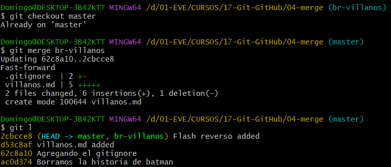

## 1. PROJECT CONFIGURATION AND BASIC COMMANDS

For this course it's necessary to have git version 2.10+

---

### 1.1 Local-repo and Remote-repo

- Remote-repo creation, name: Git-GitHub
  - Add a README file
  - Licence: GNU GLP v3
- In the file 'pry-git' open GitBash:
  - `git init` .. Local-repo creation.
  - `git remote add origin https://github.com/freddy-alexis-ht/JavaFX.git` .. Repos linking
  - `git pull origin master` .. Branches sync.

It's possible that on execution of `git init` a message is shown recommending us to change the default branch from 'master' to 'main'.

So, previous of 'git init', we can configure it with:  
`git config --global init.defaultBranch <name>`

If the branch is already created, the name can be changed with:  
`git branch -m <name>`

---

### 1.2 Project creation

- Open IntelliJ -> New project -> Java: 1.8
  - Project name: pry-git
  - Project location: ..../pry-git

---

### 1.3 Initial Commands

`git --version`

`git help` .. all the commands (this info can be found in the web)  
`git help commit` .. info about 'commit'.

`:` .. at the end of the page.  
`:q` .. 'quit', leave what we're checking.

When working on a local-repo, the email won't be validated. Every commit will have that email.  
To have a remote-repo in GitHub, Bitbucket or other, to register there we'll need an email that will be validated.  
It's recommendable that the email set in the local-repo is the same set in the remote-repo, for sync.

`git --help config`  
`git config --global user.name="freddy"`  
`git config --global user.email="freddy.alexis.ht@gmail.com`

To check the configuration:  
`git config --global --list`

To edit the configuration:
`git config --global -e` .. 'e' to open an Editor
- ..type 'a' to edit -> make changes -> Type 'Esc'

`:wq!` .. w:write -> q:quit -> !:immediately

---

### 1.4 Course project

- The project '01-bases' is given in the course:
- New module -> Name: 01-bases -> paste the files here

---

***a)Run the commands***  

`git status`  
`git add .`  
`git commit -m "Project created, module '01-bases' created and initial commands"`

- If `git init` is executed again, it doesn't delete the existing commits.

--- 

***b) Recovering a previous commit***

`git checkout -- .` .. reconstruct the project as it is in the last commit.  
Remember that it only cares about the tracked files.  
If a file was created, this command wouldn't erase it, because it would be in 'untracked' state.

---

***c) Change branch name: main -> master***

`git branch` .. display the branches.
It's better to work in other branches, not in 'master'.

`git branch -m master main` .. change the branch name from 'master' to 'main'.
This applies only to the current repo.

`git config --global init.defaulBranch main`  
This applies to all repos because it's the global config.

---

***d) Undo the 'git add' command***

`git add README.md` .. now the file is added to the stage by git (ready to be tracked).
`git reset README.md` .. the file is not staged (untracked).
`git rm --cached README.md` .. another option.

`git add 01-bases/README.md`
`git commit -m "01-bases/README.md added"`

Make some changes, commit those changes.  
It only works if the file or files are already being tracked.
`git commit -am "01-bases/README.md edited"`

`git log`  
Hash .. commit unique identifier.  
HEAD -> main .. the last commit was made in branch 'main'.  
Author .. user configuration.

---

***e) Adding files to the stage***

`git add *.html` .. all the .html files.
`git add *.js` .. if they are inside a folder, they won't be found.
`git add js/*.js` .. now it does work.

If a new folder is just created, it won't appear on 'git status'.  
Only if it has a file it will be tracked.  
For these cases, git recommends adding the file `.gitkeep`, it has no content, but it's better than adding a random file.

`git add css/` .. all the files and directories inside 'css/'.

---

***f) Alias***

`git status` .. displays a lot of information  .
`git status --short` .. displays the info only in one line.

This alias says: 'git s' is equivalent to 'git status --short'  
`git config --global alias.s "status --short"`

`git config --global --list` .. to check the global configuration.
`git config --global --edit` .. to edit the global configuration.

- In the video, the author says he uses this:
> git config --global alias.lg "log --graph --abbrev-commit --decorate --format=format:'%C(bold blue)%h%C(reset) - %C(bold green)(%ar)%C(reset) %C(white)%s%C(reset) %C(dim white)- %an%C(reset)%C(bold yellow)%d%C(reset)' --all"

As the alias were set in global mode, it affects all repos.

---
---

## 2. ADVANCED COMMANDS

### 2.1 Module '02-instalaciones' - diff and amend

---
***a) Differences: git diff***

New file: instalaciones.md  
Add some text.

`git add . -> git commit -m ".."`

Make some changes in instalaciones.md

`git diff` .. if there's only one file, there's no need in specifying a file.
`git diff 02-instalaciones/instalaciones.md` .. a file in specific

But, if `git add 02-instalaciones/instalaciones.md` is applied, when running `git diff 02-instalaciones/instalaciones.md` it will do nothing, because those changes are already in the stage.

`git diff --staged 02-instalaciones/instalaciones.md` .. it compares differences even if changes are already added to the stage.

Doing this in the Console can be confusing. It's better to use an IDE.

---

***b) Update commit messages***

Commit with a mistaken message:  
`git commit -m "incorrect message`

Rewriting the commit message:  
`git commit --amend -m "correct message`

It can be checked with:
`git log`

---

***c) Revert commit***

If after commit we feel we'd want to add some other changes to that previous commit:  
`git reset --soft HEAD^` .. 'HEAD^' is equivalent to 'HEAD^1', es un commit antes del HEAD (last one).  
If it's need to go to other previous commits: HEAD^2, HEAD^3, but it's not recommendable to go to far.

Check the logs wit 'git log'.

Then add the changes with 'git add .' and write the correct commit.  
`git commit -m "another correct message`

---
### 2.2 Module '03-heroes' - Time travel, reset and reflog

***a) Working with the project***

Consider these commits were made in different times.  
Take into consideration the folders hierarchy in the git commands.  
`git add 03-heroes/src/README.md`  
`git commit -m "README added"`

- The files will be added and committed one by one.
  - Add the README.md: message: README added
  - Add the README.md: message: misiones added
  - Add the README.md: message: heroes added
  - Add the README.md: message: ciudades added
  - Add the README.md: message: historia folder added

At this point, we notice that 'historia' folder has two files in it.  
`git commit --amend` .. displays info about the last commit.
- For example, in 'Changes to be commited' we can see that there are two files in the folder 'history'.
- So, it would be better to change the commit-message.

- To change the *commit-message*:
- Click 'A' to edit -> Edit -> Esc -> :wq!

Then, we can see the changes in the log:

Last commit of this part.
- In 'heroes.md' add the line: 'Linterna verde'.

`git add 03-heroes/src/heroes.md`  
`git commit -m "heroes.md: linterna verde added`

---

***b) Using: reset --soft (1 position)***

In heroes.md 'Robin' should've been added too.  
So, reverting the last commit (going back 1 position):  
`git reset --soft HEAD^`  
or  
`git reset --soft HEAD^1`  
or, using the hash:  
`git reset --soft 8c8084c`

In 'heroes.md' write: * Robin  
On `git status`  
.. there'll be two M's (modified)
- Green M: the 'git add' command about 'Linterna verde' entry.
- Red M: the unstaged modification about 'Robin' entry.

Next, execute the commands:  
`git add 03-heroes/src/heroes.md`  
`git commit -m "heroes.md: heroes Linterna verde and Robin added"`

Check with: `git log`

---

***c) Using: reset --mixed --hard***

- --soft: keep the files and the stages (the 'git add' command, meaning: they are in green)
- --mixed: keep the files, but unstage changes (it doesn't only revert 'commit' but 'add' also)
- --hard: destroy the files and any changes made.

- For some reason it's necessary to go back to the commit 'ciudades added' (hash: bacc4ca)  
  `git reset --mixed 2533abc`  (default: --mixed)

- Files are still there, but changes are unstaged. ('commit' and 'add' reverted)

Having seen that we don't need those changes, they can be discarded:  
`git reset --hard 2533abc`  
The files deleted can be recovered, but this will be seen later.

Note that even when the commit related to 'historia' folder has been reset, it's still there. The files are not tracked.

---

***d) Reverting the reset***

We realized that the commits were ok, and we want to undo all the resets (soft, mixed, hard), we want to go back to were 'Linterna verde' and 'Robin' were added (hash: ea4bf49).    
Each 'hash' represents modifications in the history of logs.

`git reflog`

- Note that currently we're now in the 'HEAD@{0}', right after we run 'git reset --hard'.
  - 'HEAD@{0}' is the 'git reset --hard'.
  - 'HEAD@{1}' is the 'git reset --mixed'.
  - 'HEAD@{3}' is the 'git reset --soft'.

- Going back to the hash: ea4bf49  
  `git reset --hard ea4bf49`  
  `git log`

- These operations shouldn't be done freely because they might be dangerous.
- It's better to create a branch, work there, and once we're sure our changes are correct, merge our branch with the 'master' one.

---

### 2.3 Module '03-heroes' - change name and delete files with git

***a) Renaming***

In '03-heroes/src/' create the file 'destroy.md' and add some text.
- This file contains info to destroy the world.  
  `git add 03-heroes/src/destroy.md`
  `git commit -m "destroy.md added"`  
  `git log`

But, what about if it was a mistake, the file should be called 'save.md' and it should contain info to save the world.
- To restore this, we could use the 'reset' commands.
- Notice that if 'reset' is applied, then the commit will be reverted, and in future logs the last commit won't be displayed.

If I want to keep the commit in the logs, and I want to change the file name and its info:
>mv: move, if it moves in the same place it renames the file

`git mv 03-heroes/src/destroy.md 03-heroes/src/save.md`

The file-name now is 'save.md'. It can be seen with:

`git status`

We have what we wanted, everything in the logs.

---

***b) Deleting***

`git rm 03-heroes/src/save.md`  
When the file is deleted, it's still in the stage (to be committed).
- It can be brought back with:  
  `git reset --hard` .. but it's better to use:  
  `git checkout -- .`

So, we go again:  
`git rm 03-heroes/src/save.md`  
`git status`  
`git commit -m "save.md deleted"`

`git log`    
We have what we wanted, everything in the logs.

---

### 2.4 Module '03-heroes' - change name and delete files without git

***a) Renaming***

We have:
- historia (directory)
  - batman.historia.md (file)
  - superman.historia.md (file)

Those files are inside 'historia', so having 'historia' in their names is repetitive.
- Right click -> Refactor -> Rename -> superman.md

In the image, git recognizes the action of rename.

> In the video, it's different, maybe because of the git version.  
> There, after 'git status' it was like:
> -  D historia/superman.historia.md
> - ?? historia/superman.md
>
> Meaning that, it consider that the original file was deleted, and a new one was created.

> After executing 'git add .' and 'git status', it was like this:
> - R historia/superman.historia.md -> historia/superman.md
>
> At this point, git recognized that both files are the same, it just was renamed.
> And that's exactly what git did in my case.

`git commit -m "superman.historia.md renamed to superman.md"`  

If we go back 1 commit with:  
`git reset --hard db39a6d`  
We'll see how git sets back the name to 'superman.historia.md'.  

And, executing:  
`git reflog`
`git reset --hard 91964ea`  
We go back to the last commit, when the name was 'superman.md'.  

---

***b) Deleting***  

Differences:
- Deleting via git: it keeps the file as staged (git add applied).
- Deleting via IDE (manual): the file is un-staged (has to apply git add).

---

### 2.5 Ignoring files

Create some files that we don't want to be tracked.  
`git status`  

Create the file '.gitignore'. It should be tracked, because we might add some more files we don't want to track.  
The first one is for directories, and the next one for files.  
> dont-track-this/  
> dont-track-me.md

`git status` .. it only displays the .gitignore.  

---
---

## 3. BRANCHES & MERGE

***a) Merge types***

- Fast-forward: There are no changes in the master-branch, so the changes in the other-branch can be merged easily. Each commit will be part of the master-branch, just like if the other-branch wouldn't have been created.  
- Automatic merge: There were changes in the master-branch, but there are no conflicts with what's been changed in the other-branch.
- Manual merge: In both branches the same code was modified, git will ask us to solve it manually. After the problem is solved, git creates the 'merge-commit' and we can continue.

---

### 3.1 Project '04-merge' - Fast-forward merge

***a) Project***

- The project '04-merge' is included in the course.  

- It already has a .git, which means it already has a history.

---

***b) Working with the branch***

While being in 'master' create the file 'villanos.md', add some code.  
In the image, the first status displays villanos.md and a directory that I included in the .gitignore.  
I added that in the .gitignore. That's why now the .gitignore is displayed with the 'M' of 'modified'.  

`git branch br-villanos` .. to create a branch.  
`git branch` .. to see the current branch and the rest of them.  
`git checkout br-villanos` .. to jump to another branch.  

In the logs, we can see that the last commit for both branches is the 'Agregando el gitignore'.  

Being in the br-villanos branch, run these commands:  
`git add .`  
`git commit -m "..."`  
`git log`

In the logs we can see that 'master' is 1 commit behind 'br-villanos'  

Still in 'br-villanos' edit the 'villanos-md' file.
`git commit -am "..."`  
`git log`

In the logs we can see that 'master' is 2 commits behind 'br-villanos'

---

***c) Merging***

If we go back to 'master' the 'villanos.md' file won't be there.  
Maybe that file is ready to pass to the 'master', this is how it's done.  

> To merge changes in branch-A to branch-B, we have to in branch-B.

So, to merge changes from 'villanos.md' to 'master', we have to be in 'master'.  

`git checkout master`  
`git merge br-villanos`  
`git log`  

In the image, it says that it was 'Fast-forward' merge, meaning that there was no conflict.  
We also can see that both branches are on the same level now.  

After a successful merge, the 'br-villanos' branch should be deleted.  

`git branch -d br-villanos`  

If there are some changes that haven't been committed, git will warn us about that.  
If we don't mind about those changes, to force the deletion we can use: 

`git branch -d br-villanos -f`

---

### 3.2 Project '04-merge' - Automatic merge

To create a branch and to move to it:  
`git branch br-villanos`  
`git checkout br-villanos`  

It can be done in one step:  
`git checkout -b br-villanos`  

Being in 'br-villanos' branch, in 'villanos.md' add the last line (4.).  

~~~
## Villanos

1. Lex Luthor
2. Joker
3. Flash Reverso
4. Doomsday
~~~

`git commit -am "Doomsday added"`

After the commit I add another line to 'villanos.md', it can be seen with 'git status'.  

`git commit -am "Notes added"`

On 'git log' we'll see that 'master' is 2 commits behind.  

Suddenly, we are asked to change something, but as the 'br-villanos' is not ready to be merged and the request is urgent, the changes are made in 'master'.  

`git checkout master`  

In 'heroes.md' delete 'Daredevil'.  

`git commit -am "Daredevil deleted"`

Now, we know that 'master' has its own commits in its timeline.  
Also, 'br-villanos' has its own commits in its timeline.  

> In this part I'll use this alias:
> git config --global alias.lg "log --graph --abbrev-commit --decorate --format=format:'%C(bold blue)%h%C(reset) - %C(bold green)(%ar)%C(reset) %C(white)%s%C(reset) %C(dim white)- %an%C(reset)%C(bold yellow)%d%C(reset)' --all"

`git lg`  

It's time to merge both branches.  

`git merge br-villanos`  

It will display:

- In the editor: Click 'A' to edit -> change the message to "Merge 'master with branch 'br-villanos'" -> Esc -> :wq!

  
  

- If the modified files are text, and if they are modified in different places, then git will use this strategy ('ort', formerly known as 'recursive')  
- But if the files are binaries, like images, even if they are not modified in the same place, git will consider that there is conflict.  

**To avoid confusions**  

1. The three commits are merged:
  - So, Daredevil will be deleted and Doomsday and notes will be added. This is how the 'master' will end.
  - Don't confuse, the 'br-villanos' branch will continue with its 2 commits, Doomsday and notes are added, and Daredevil will be there, because it wasn't affected in this timeline.  
~~~
    · 6f850f5 - (4 minutes ago) Merge 'master with branch 'br-villanos' - Freddy2 (HEAD -> master)  
    |\  
    | · 6ed8522 - (18 minutes ago) Notes added - Freddy2 (br-villanos)  
    | · e0e9975 - (22 minutes ago) Doomsday added - Freddy2  
    · | 238ae61 - (14 minutes ago) Daredevil deleted - Freddy2  
    |/  
    · 2cbcce8 - (74 minutes ago) Flash reverso added - Freddy2  
~~~

---

### 3.3 Project '04-merge' - Manual merge (conflicts)  

Both branches modified the same file.

`git checkout -b br-conflicto`  
Edit 'misiones.md'.  
`git commit -am "misiones.md updated"`  

`git checkout master`  
Edit 'misiones.md'.  
`git commit -am "misiones.md updated in master"`  

`git merge br-conflicto`  
> Auto-merging misiones.md  
> CONFLICT (content): Merge conflict in misiones.md  
> Automatic merge failed; fix conflicts and then commit the result.  

- The files that didn't have conflicts will be merged.  
- After fixing the conflict, another commit should be run.

IntelliJ display the conflict like this:  
- From line 1 to 4 both have the same content.
- HEAD refers to the last commit, in this case it was in 'master'.  
  - Between HEAD and ===, are displayed the differences.
- br-conflicto is the other branch.  
  - Between === and br-conflito, are displayed the differences.

Read the conflict and solve it manually. Then commit.  

`git commit -am "Conflict solved"`  

Delete the other branch.  

